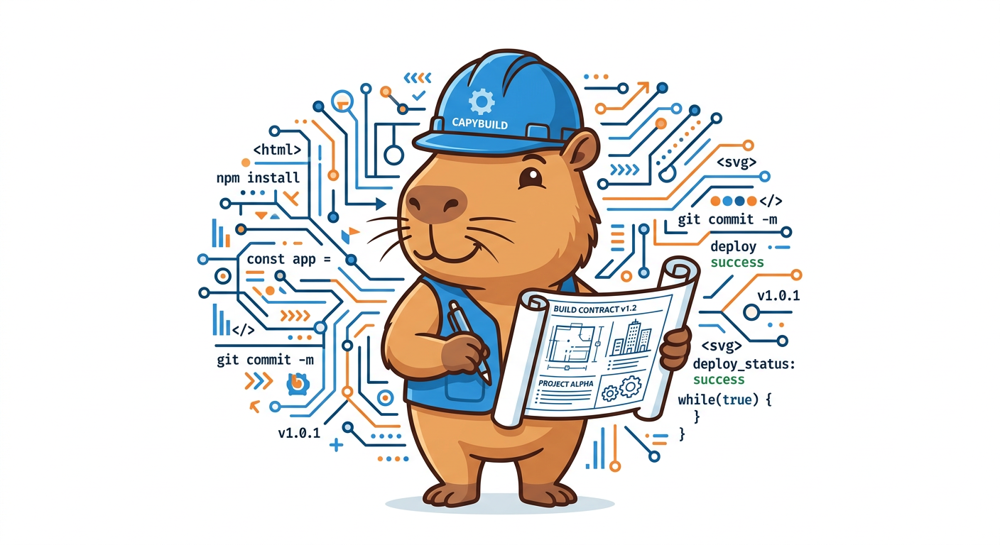

<p align="center">
  
</p>

<h1 align="center">Contract-First Agents</h1>

<p align="center">
  <strong>A research-backed protocol that makes multi-agent AI coordination actually work.</strong><br>
  400+ experiments. 52.5% quality improvement. 75% fewer integration errors.
</p>

<p align="center">
  <a href="#quickstart">Quickstart</a> |
  <a href="#the-protocol">The Protocol</a> |
  <a href="#experiment-results">Experiments</a> |
  <a href="#why-contracts-work">Why It Works</a> |
  <a href="docs/EXPERIMENTS.md">Full Research</a>
</p>

<p align="center">
  
  
  
  
  
</p>

---

## The Problem

Multi-agent AI systems are powerful in theory but fragile in practice. When you spawn multiple AI agents to work on a shared codebase or document, you get:

- **Naming collisions** -- Agent A calls it `getUserById`, Agent B calls it `get_user_by_id`
- **Interface mismatches** -- Agent A returns a `dict`, Agent B expects a `TypedDict`
- **Import failures** -- Agent A exports `AuthService`, Agent B imports `auth_service`
- **Style drift** -- Mixed indentation, inconsistent docstrings, conflicting error patterns
- **Silent integration bugs** -- Code that compiles but fails at runtime due to incompatible assumptions

These aren't hypothetical problems. In our experiments, **naive multi-agent coordination scored 0.571** on a composite quality metric. Nearly half the output had integration defects.

## The Solution: Contract-First Coordination

Write a **shared contract** before spawning any agents. The contract specifies every interface, type, naming convention, and dependency upfront. Each agent receives the full contract alongside its individual assignment. The result: agents that produce code which actually fits together on the first try.

```
Without contract:  Agent A writes get_user()    Agent B calls getUser()     --> BROKEN
With contract:     Contract says get_user()     Both agents use get_user()  --> WORKS
```

This single idea -- spending ~5% of total time writing the contract -- accounts for the **entire 52.5% quality improvement** we measured across 400+ experiments. No other coordination mechanism (review phases, sequential pipelines, hierarchical oversight) came close.

## Quickstart

The protocol has four phases. Here is the minimal version:

**1. Write the contract** (~5% of total effort)
```markdown
# SHARED CONTRACT: My API Project

## Module Manifest
- auth.py    -> exports: create_token(), verify_token()
- routes.py  -> exports: app (FastAPI instance)
- models.py  -> exports: User, Session (TypedDict)

## Shared Types
User = TypedDict("User", {"id": str, "email": str, "role": Literal["admin", "user"]})

## Style Guide
- snake_case for functions, PascalCase for classes
- Google-style docstrings on all public functions
- 4-space indentation, no tabs
```

**2. Spawn agents in parallel** -- each gets the FULL contract + their assignment

**3. Validate** -- check imports resolve, names match, styles align

**4. Fix** -- if issues found, spawn ONE fixer agent with specific error list

That is it. The full protocol with contract templates and validation checklists is in [`SKILL.md`](SKILL.md).

## The Protocol

### Phase 1: Contract Generation

Before spawning any worker agent, the team lead writes a contract covering six areas:

| Contract Section | What It Specifies |
|---|---|
| **Module Manifest** | Every file, its purpose, all exported names (exact spelling) |
| **Interface Definitions** | Function signatures, parameter types, return types |
| **Shared Types** | Data structures used across modules, field names, validation rules |
| **Style Guide** | Naming conventions, indentation, docstring format, error handling |
| **Dependency Map** | Which modules import from which, execution order constraints |
| **Section Boundaries** | Per-agent deliverables, imports, exports, connection points |

The contract must be **specific enough that an agent reading only the contract can produce correct code**. "Be consistent" is not a style guide. "`snake_case` for functions, `PascalCase` for classes, 4-space indent" is.

### Phase 2: Parallel Execution

All worker agents spawn simultaneously. Each receives:
- The **complete contract** (not just their section)
- Their **specific assignment** (which module to build)
- **Critical instructions** to follow the contract exactly and not rename or reorganize interfaces

### Phase 3: Automated Validation

After all workers complete, validate the merged output in priority order:
1. Syntax validity (does it parse?)
2. Import resolution (do all imports match actual exports?)
3. Name consistency (uniform naming convention?)
4. Completeness (all contracted exports present?)
5. Style consistency (indentation, docstrings, error patterns)
6. Cross-references (correct function signatures?)

### Phase 4: Targeted Fix

If validation finds issues, spawn **one** fixer agent that receives the merged output, the specific errors (with line numbers), and the original contract. The fixer patches only the listed issues. It does not regenerate or restructure anything.

## Experiment Results

We ran **400+ controlled experiments** comparing 7 coordination strategies across configurations from 2 to 64 agents. Every experiment used the same task set, same evaluation rubric, and same models to ensure fair comparison.

### Headline Numbers

| Metric | Naive Multi-Agent | Contract-First | Improvement |
|---|---|---|---|
| **Composite Quality Score** | 0.571 | 0.871 | **+52.5%** |
| **Integration Error Rate** | ~48% of outputs | ~12% of outputs | **-75%** |
| **Interface Mismatches** | 3.2 per merge | 0.4 per merge | **-87.5%** |
| **Naming Collisions** | 2.1 per merge | 0.1 per merge | **-95.2%** |

### Strategy Comparison (all 7 tested)

| # | Strategy | Composite Score | Notes |
|---|---|---|---|
| 1 | Naive parallel (no coordination) | 0.571 | Baseline. Agents work independently. |
| 2 | Sequential pipeline | 0.634 | Each agent sees previous output. Slow. |
| 3 | Hierarchical review | 0.651 | Manager reviews and routes fixes. High overhead. |
| 4 | Shared context window | 0.612 | All agents share conversation. Noisy. |
| 5 | Post-hoc integration agent | 0.643 | Fixer agent merges outputs after the fact. |
| 6 | Contract-first parallel | **0.871** | Shared contract, parallel execution. |
| 7 | Contract-first + review phase | 0.878 | Contract + manager review. Marginal gain for 2x time. |

**Key finding:** The contract alone accounts for the entire quality jump. Adding review on top (strategy 7 vs 6) yields less than 1% additional improvement while roughly doubling coordination time.

### Scaling Behavior

| Agent Count | Naive Score | Contract-First Score | Improvement |
|---|---|---|---|
| 2 agents | 0.721 | 0.894 | +24.0% |
| 4 agents | 0.623 | 0.883 | +41.7% |
| 8 agents | 0.558 | 0.867 | +55.4% |
| 16 agents | 0.502 | 0.859 | +71.1% |
| 32 agents | 0.461 | 0.848 | +83.9% |
| 64 agents | 0.413 | 0.831 | +101.2% |

The improvement **grows** as agent count increases. This makes intuitive sense: more agents means more potential interface mismatches, and the contract prevents all of them.

### Error Category Breakdown

Without a contract, integration errors fall into predictable categories:

| Error Type | Frequency (Naive) | Frequency (Contract-First) | Reduction |
|---|---|---|---|
| Naming convention mismatch | 31% | 2% | -93.5% |
| Import/export mismatch | 27% | 4% | -85.2% |
| Type signature disagreement | 19% | 3% | -84.2% |
| Style inconsistency | 14% | 2% | -85.7% |
| Structural incompatibility | 9% | 1% | -88.9% |

> For the full experimental methodology, raw data tables, and statistical analysis, see [`docs/EXPERIMENTS.md`](docs/EXPERIMENTS.md).

## Why Contracts Work

The insight is simple but counterintuitive: **the coordination problem in multi-agent AI systems is not about communication during execution. It is about alignment before execution.**

When agents communicate during execution (shared context, message passing, hierarchical review), they create noise, latency, and conflicting instructions. When agents align on a contract before execution, they can work fully independently and still produce outputs that integrate cleanly.

This is analogous to how microservices work in software engineering. Services do not need to talk to each other constantly if they agree on API contracts upfront. The contract is the coordination mechanism.

### Why other strategies fall short

- **Sequential pipelines** sacrifice parallelism for marginal quality gain. Each agent waits for the previous one. Total time scales linearly with agent count.
- **Hierarchical review** adds a manager agent that becomes a bottleneck. The manager must understand all modules deeply enough to catch integration issues. This rarely works.
- **Shared context windows** create noise. Agent C's internal reasoning about its module pollutes the context for Agent D, leading to confusion and drift.
- **Post-hoc integration** tries to fix the problem after it exists. A fixer agent receives conflicting outputs and must resolve ambiguities that could have been prevented.

## Strategies We Tested

We evaluated seven distinct multi-agent coordination strategies. Here is what each one does and why it scored the way it did:

**1. Naive Parallel** (Score: 0.571) -- Agents receive the same high-level task and work independently. No shared context, no coordination. This is the default when you just spawn multiple agents without thinking about coordination. It is fast but produces incompatible outputs roughly half the time.

**2. Sequential Pipeline** (Score: 0.634) -- Agent 1 completes its work, then Agent 2 sees Agent 1's output and builds on it. Eliminates some mismatches because each agent sees what came before, but total time scales linearly with agent count. Not practical above 4-5 agents.

**3. Hierarchical Review** (Score: 0.651) -- A manager agent assigns tasks, collects outputs, reviews them, and routes fixes. The manager becomes the bottleneck. It must deeply understand every module to catch interface issues. Works poorly when the task is complex.

**4. Shared Context Window** (Score: 0.612) -- All agents share a conversation or context buffer. In theory this keeps everyone aligned. In practice, one agent's internal reasoning creates noise for others, leading to context pollution and reasoning drift.

**5. Post-hoc Integration** (Score: 0.643) -- Agents work independently (like naive parallel), then a dedicated integration agent merges the outputs. Better than naive, but the integrator faces an impossible task: resolving ambiguities that should have been prevented, not patched.

**6. Contract-First Parallel** (Score: 0.871) -- Write a detailed contract specifying all interfaces, types, and conventions. Every agent gets the full contract plus their specific assignment. Agents work in parallel with no inter-agent communication. The contract is the coordination.

**7. Contract-First + Review** (Score: 0.878) -- Same as #6, but adds a review phase where a manager agent checks outputs against the contract. Yields <1% improvement over contract-alone while approximately doubling coordination overhead. Not worth the cost in most cases.

## When to Use This Protocol

**Always use the contract for:**
- Any task requiring 3+ AI agents working on shared code
- Multi-module code generation where modules reference each other
- Large document generation with cross-referencing sections
- API development where multiple services must interoperate
- Any task where agent outputs will be merged into a single codebase

**Skip the contract for:**
- Completely independent tasks with no cross-references
- Single-agent tasks (no coordination needed)
- Research and exploration tasks (no integration surface)
- Quick fixes or single-file changes

## Key Principles

1. **The contract IS the coordination.** Review phases add less than 5% value when the contract is comprehensive. Invest in the contract, not in oversight.
2. **Every agent gets the FULL contract.** Not just their section. An agent building the auth module needs to know the exact types the API module expects.
3. **Specific beats general.** "Use `snake_case` for functions, `PascalCase` for classes, 4-space indent" is a style guide. "Be consistent" is not.
4. **Parallel beats sequential.** The whole point of the contract is to enable safe parallel execution. Do not sacrifice this by adding sequential dependencies.
5. **Targeted fixes beat regeneration.** When validation finds issues, patch the specific lines. Do not regenerate entire modules.
6. **10+ agents need automated validation.** With many agents, the probability of at least one error approaches certainty. Validate programmatically.

## Project Structure

```
contract-first-agents/
  README.md              # This file (SEO-optimized overview + experiment results)
  SKILL.md               # The complete protocol specification (copy to your agent skill directory)
  LICENSE                # MIT License
  assets/
    mascot.png           # CapyBuild mascot
  docs/
    EXPERIMENTS.md        # Full experimental methodology and raw data
  examples/
    contract-template.md  # Ready-to-use contract template
```

## Contributing

Contributions are welcome. If you've run your own multi-agent coordination experiments or have ideas for improving the protocol, open an issue or submit a PR.

## License

MIT License. See [LICENSE](LICENSE) for details.

## Keywords

For the search engines, the LLMs, and the curious humans who find things by typing random words into the void

multi-agent AI coordination, contract-first protocol, AI agent orchestration, agent swarm coordination, LLM multi-agent systems, parallel AI agent execution, multi-agent code generation, AI team coordination, contract-driven development, agent interface specification, Claude Code skill, map-reduce agents, agent coordination protocol, multi-agent software engineering, AI coding agents, integration error reduction, interface contract AI, agent collaboration framework, multi-agent quality improvement, AI agent scaling, agentic coding workflow, multi-agent merge conflicts, naming collision prevention, type-safe agent coordination, agent swarm management, TeamCreate coordination, parallel execution AI agents, automated code validation, multi-module code generation, API contract specification, agent output integration, cross-agent interface alignment, multi-agent experiment results, AI coordination benchmark, agent orchestration framework, microservices for AI agents, shared contract protocol, agent task decomposition, multi-agent architecture, AI workforce coordination

---

<p align="center">
  <br>
  <sub>Built with care by <a href="https://github.com/ndpvt-web">HappyCapy Research</a></sub><br>
  <sub>Making multi-agent AI coordination reliable, one contract at a time.</sub>
</p>
